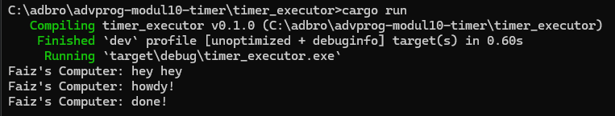
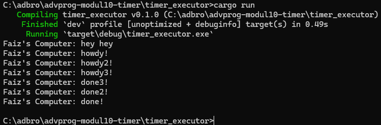
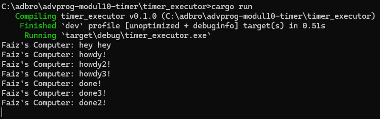

# Module 10: Asynchronous Programming - Tutorial 1: Timer

## Experiment 1.2: Understanding how it works

Setelah menambahkan `println!("Nama Anda: hey hey");` tepat setelah pemanggilan `spawner.spawn(...)`, dan sebelum `drop(spawner);` serta `executor.run();`, output yang terlihat adalah sebagai berikut:

Penjelasan:
Output ini menunjukkan bahwa baris `println!("Nama Anda: hey hey");` dieksekusi segera setelah task di-spawn, namun sebelum task tersebut mulai dieksekusi sepenuhnya oleh `executor.run()`. Ini terjadi karena `spawner.spawn` hanya meletakkan future ke dalam antrian task (channel), tetapi tidak langsung menjalankannya. Future tersebut baru akan "dipolling" dan dieksekusi ketika `executor.run()` dipanggil.

Dengan kata lain, kode di dalam `main` function (termasuk `println!("Nama Anda: hey hey");`) dieksekusi secara sinkron hingga `executor.run()` dipanggil. Task asynchronous yang di-spawn akan mulai berjalan hanya ketika executor mengambilnya dari antrian. Oleh karena itu, pesan "hey hey" muncul lebih dulu, diikuti dengan eksekusi task asynchronous yang mencetak "howdy!" dan "done!" dengan jeda.

## Experiment 1.3: Multiple Spawn and removing drop

### Multiple Spawn

Ketika kita melakukan multiple `spawner.spawn(...)`, semua task asynchronous yang kita definisikan akan ditambahkan ke dalam antrian executor. Outputnya akan terlihat seperti ini (urutan `howdy` bisa bervariasi karena scheduling):

Efek dari spawning adalah kita dapat menambahkan beberapa tugas ke dalam executor untuk dijalankan secara konkruen. Executor akan mengambil tugas-tugas ini dari antrian dan memprosesnya. Karena tugas-tugas ini bersifat asynchronous, mereka tidak saling memblokir. Dalam kasus ini, semua pesan "howdy!" akan tercetak hampir bersamaan (atau interleaved) sebelum penundaan 2 detik, dan semua pesan "done!" akan tercetak setelah penundaan selesai untuk semua task.

### Removing `drop(spawner);`

Ketika baris `drop(spawner);` dihilangkan atau dikomentari, program akan berjalan tanpa henti. Outputnya akan mirip dengan ini (tergantung kapan kamu menghentikannya secara manual):
